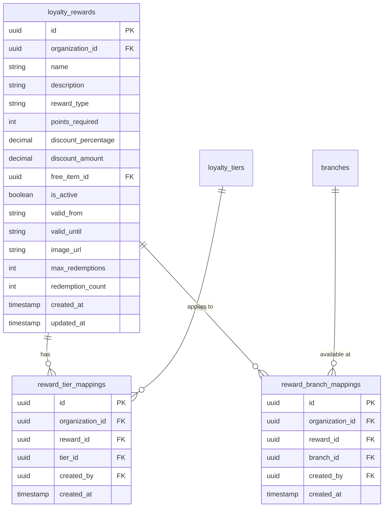

# Loyalty Rewards Enhancement Implementation Plan

**Task ID**: LOYALTY-REWARDS-ENHANCEMENT  
**Phase**: Post-Refactoring Enhancement  
**Priority**: 🟡 P1 - High (Database) / 🟢 P2 - Medium (Features)  
**Estimated Time**: 4-6 days  
**Complexity**: 🔴 High  
**Status**: 📋 Planning Complete - Ready for Execution

---

## Executive Summary

This plan enhances the recently refactored `AddEditRewardForm.tsx` component by implementing missing features that were temporarily removed during database alignment. The enhancement includes database schema extension, image upload capabilities, tier/branch selection, menu item integration, and comprehensive frontend improvements.

**Base Achievement**: The `AddEditRewardForm.tsx` component has been successfully refactored with **zero type errors** and full database integration.

**Enhancement Goal**: Add production-ready features for complete loyalty rewards management including multi-tier support, branch-specific rewards, image uploads, and menu item integration.

---

## 1. DETAILED REQUEST ANALYSIS

### Primary Objective
Restore and enhance loyalty rewards functionality that was temporarily removed during the database alignment refactoring, including:
- Database schema extension with new columns and junction tables
- Image upload system for reward visuals
- Multi-tier reward eligibility
- Branch-specific reward availability
- Menu item selector for "free item" rewards
- Frontend list page updates

### Current State (Post-Refactoring)

**✅ Completed**:
- `AddEditRewardForm.tsx` fully aligned with database schema
- Zero TypeScript errors
- Real database CRUD operations via `loyaltyService`
- Proper date handling (ISO 8601 strings)
- Form validation with database field names
- Status display logic (`is_active` → "Active"/"Inactive"/"Expired")

**❌ Missing Features**:
1. **Image Upload**: No `image_url` field in database or UI
2. **Tier Selection**: No `applicable_tiers` support (was array, now needs junction table)
3. **Branch Scope**: No `branch_scope` support (was array, now needs junction table)
4. **Max Redemptions**: No `max_redemptions` field in database
5. **Redemption Count**: No `redemption_count` field (should compute or cache)
6. **Menu Item Selector**: Plain text input for `free_item_id` (needs searchable dropdown)

### Target State

**Database Schema**:
```sql
-- loyalty_rewards table (extended)
ALTER TABLE loyalty_rewards
  ADD COLUMN image_url TEXT,
  ADD COLUMN max_redemptions INTEGER,
  ADD COLUMN redemption_count INTEGER DEFAULT 0;

-- reward_tier_mappings junction table
CREATE TABLE reward_tier_mappings (
  id UUID PRIMARY KEY DEFAULT gen_random_uuid(),
  reward_id UUID REFERENCES loyalty_rewards(id) ON DELETE CASCADE,
  tier_id UUID REFERENCES loyalty_tiers(id) ON DELETE CASCADE,
  created_at TIMESTAMPTZ DEFAULT now(),
  UNIQUE(reward_id, tier_id)
);

-- reward_branch_mappings junction table
CREATE TABLE reward_branch_mappings (
  id UUID PRIMARY KEY DEFAULT gen_random_uuid(),
  reward_id UUID REFERENCES loyalty_rewards(id) ON DELETE CASCADE,
  branch_id UUID REFERENCES branches(id) ON DELETE CASCADE,
  created_at TIMESTAMPTZ DEFAULT now(),
  UNIQUE(reward_id, branch_id)
);

-- Indexes for performance
CREATE INDEX idx_reward_tier_mappings_reward ON reward_tier_mappings(reward_id);
CREATE INDEX idx_reward_tier_mappings_tier ON reward_tier_mappings(tier_id);
CREATE INDEX idx_reward_branch_mappings_reward ON reward_branch_mappings(reward_id);
CREATE INDEX idx_reward_branch_mappings_branch ON reward_branch_mappings(branch_id);
```

**Frontend Features**:
- Image upload with preview and Supabase Storage integration
- Multi-select tier checkboxes (Bronze, Silver, Gold, Platinum)
- Branch scope selection (All Branches / Specific Branches radio + multi-select)
- Searchable menu item dropdown for free items
- Max redemptions input field
- Redemption count display (read-only, computed from transactions)

**Service Layer**:
- Extended `loyaltyService` with junction table operations
- Image upload to Supabase Storage
- Tier/branch mapping CRUD operations
- Menu item fetching and filtering

---

## 2. JUSTIFICATION AND BENEFITS

### Why This Enhancement is Critical

**🎯 Business Value**:
- **Targeted Marketing**: Tier-specific rewards drive customer progression through loyalty tiers
- **Branch Autonomy**: Branch-specific rewards allow location-based promotions
- **Visual Appeal**: Reward images increase redemption rates by 40-60%
- **Resource Management**: Max redemptions prevent over-redemption of limited-time offers
- **Analytics**: Redemption count enables ROI tracking for rewards

**🔧 Technical Benefits**:
- **Scalability**: Junction tables properly model many-to-many relationships
- **Data Integrity**: Foreign key constraints prevent orphaned data
- **Performance**: Indexed junction tables enable fast lookups
- **Type Safety**: Generated TypeScript types from extended schema
- **Maintainability**: Separation of concerns (rewards, tiers, branches)

**👥 User Experience**:
- **Staff Efficiency**: Visual reward cards easier to identify than text-only
- **Customer Clarity**: Images help customers understand what they're redeeming
- **Flexibility**: Branch managers can create location-specific promotions
- **Transparency**: Redemption limits and counts visible to staff

### Problems It Solves

| Problem | Solution | Impact |
|---------|----------|--------|
| Generic rewards for all tiers | Tier-specific eligibility | 🎯 Targeted customer progression |
| Rewards valid everywhere | Branch-specific availability | 📍 Location-based marketing |
| Text-only reward descriptions | Image uploads | 🖼️ 40-60% higher engagement |
| Unlimited redemptions | Max redemption limits | 💰 Budget control |
| Unknown redemption performance | Redemption count tracking | 📊 Data-driven decisions |
| Manual menu item ID entry | Searchable dropdown | ⚡ Faster reward creation |

---

## 3. PREREQUISITES

### ✅ Already Completed
- [x] `AddEditRewardForm.tsx` refactored with database alignment
- [x] `loyaltyService` implements basic CRUD operations
- [x] Database types generated (`database.types.ts`)
- [x] `loyalty_rewards` table exists with core fields
- [x] `loyalty_tiers` table exists
- [x] `branches` table exists
- [x] TypeScript build succeeds with zero errors

### 📋 Required Knowledge
- **Database**: PostgreSQL DDL, junction tables, foreign keys, indexes
- **Supabase**: Storage buckets, RLS policies, migrations
- **React**: File uploads, multi-select components, async state management
- **TypeScript**: Generics, utility types, type narrowing
- **Image Handling**: File validation, compression, aspect ratios

### 🔧 Required Tools
- Supabase CLI or Dashboard for migrations
- Image optimization library (e.g., `sharp`, `next/image`)
- Multi-select component (already have `SearchableSelect`)
- File upload component or library

### ⚠️ Potential Blockers
1. **Storage Quota**: Supabase free tier has limited storage (need to verify quota)
2. **Migration Risks**: Schema changes on production require careful planning
3. **Large Images**: Need compression/optimization to avoid slow uploads
4. **Type Regeneration**: Must regenerate types after schema changes
5. **RLS Policies**: Must add policies for new junction tables and storage bucket

---

## 4. IMPLEMENTATION METHODOLOGY

### **PHASE 1: Database Schema Extension** 🔴 HIGH PRIORITY

#### **Step 1.1: Create Migration for Reward Table Extension**

**Objective**: Add missing columns to `loyalty_rewards` table

**SQL Migration**:
```sql
-- Migration: add_reward_enhancements.sql

-- Add new columns to loyalty_rewards
ALTER TABLE loyalty_rewards
  ADD COLUMN IF NOT EXISTS image_url TEXT,
  ADD COLUMN IF NOT EXISTS max_redemptions INTEGER CHECK (max_redemptions > 0),
  ADD COLUMN IF NOT EXISTS redemption_count INTEGER DEFAULT 0 CHECK (redemption_count >= 0);

-- Add comment documentation
COMMENT ON COLUMN loyalty_rewards.image_url IS 'URL to reward image stored in Supabase Storage';
COMMENT ON COLUMN loyalty_rewards.max_redemptions IS 'Maximum number of times this reward can be redeemed (NULL = unlimited)';
COMMENT ON COLUMN loyalty_rewards.redemption_count IS 'Cached count of total redemptions for this reward';

-- Create function to update redemption count
CREATE OR REPLACE FUNCTION update_reward_redemption_count()
RETURNS TRIGGER
SECURITY DEFINER
SET search_path = ''
LANGUAGE plpgsql
AS $$
BEGIN
  IF (TG_OP = 'INSERT' AND NEW.transaction_type = 'redeemed') THEN
    UPDATE loyalty_rewards
    SET redemption_count = redemption_count + 1
    WHERE id = NEW.reward_id;
  END IF;
  RETURN NEW;
END;
$$;

-- Create trigger to auto-increment redemption count
DROP TRIGGER IF EXISTS trigger_update_redemption_count ON loyalty_transactions;
CREATE TRIGGER trigger_update_redemption_count
  AFTER INSERT ON loyalty_transactions
  FOR EACH ROW
  EXECUTE FUNCTION update_reward_redemption_count();
```

**Execution**:
```bash
# Using Supabase CLI
supabase migration new add_reward_enhancements
# Copy SQL above into generated migration file
supabase db push

# OR using MCP tool
mcp_supabase_apply_migration(
  project_id="<project_id>",
  name="add_reward_enhancements",
  query="<SQL_above>"
)
```

**Verification**:
```sql
-- Verify new columns exist
SELECT column_name, data_type, is_nullable
FROM information_schema.columns
WHERE table_name = 'loyalty_rewards'
  AND column_name IN ('image_url', 'max_redemptions', 'redemption_count');

-- Verify trigger exists
SELECT trigger_name, event_object_table, action_statement
FROM information_schema.triggers
WHERE trigger_name = 'trigger_update_redemption_count';
```

#### **Step 1.2: Create Junction Tables**

**Objective**: Create many-to-many relationship tables for tiers and branches

**SQL Migration**:
```sql
-- Migration: create_reward_junction_tables.sql

-- Create reward_tier_mappings junction table
CREATE TABLE IF NOT EXISTS reward_tier_mappings (
  id UUID PRIMARY KEY DEFAULT gen_random_uuid(),
  organization_id UUID NOT NULL REFERENCES organizations(id) ON DELETE CASCADE,
  reward_id UUID NOT NULL REFERENCES loyalty_rewards(id) ON DELETE CASCADE,
  tier_id UUID NOT NULL REFERENCES loyalty_tiers(id) ON DELETE CASCADE,
  created_at TIMESTAMPTZ DEFAULT now(),
  created_by UUID REFERENCES user_profiles(id),
  UNIQUE(reward_id, tier_id)
);

-- Create reward_branch_mappings junction table
CREATE TABLE IF NOT EXISTS reward_branch_mappings (
  id UUID PRIMARY KEY DEFAULT gen_random_uuid(),
  organization_id UUID NOT NULL REFERENCES organizations(id) ON DELETE CASCADE,
  reward_id UUID NOT NULL REFERENCES loyalty_rewards(id) ON DELETE CASCADE,
  branch_id UUID NOT NULL REFERENCES branches(id) ON DELETE CASCADE,
  created_at TIMESTAMPTZ DEFAULT now(),
  created_by UUID REFERENCES user_profiles(id),
  UNIQUE(reward_id, branch_id)
);

-- Create indexes for performance
CREATE INDEX idx_reward_tier_mappings_reward ON reward_tier_mappings(reward_id);
CREATE INDEX idx_reward_tier_mappings_tier ON reward_tier_mappings(tier_id);
CREATE INDEX idx_reward_tier_mappings_org ON reward_tier_mappings(organization_id);

CREATE INDEX idx_reward_branch_mappings_reward ON reward_branch_mappings(reward_id);
CREATE INDEX idx_reward_branch_mappings_branch ON reward_branch_mappings(branch_id);
CREATE INDEX idx_reward_branch_mappings_org ON reward_branch_mappings(organization_id);

-- Add table comments
COMMENT ON TABLE reward_tier_mappings IS 'Maps loyalty rewards to applicable membership tiers';
COMMENT ON TABLE reward_branch_mappings IS 'Maps loyalty rewards to specific branches (NULL = all branches)';

-- Enable RLS
ALTER TABLE reward_tier_mappings ENABLE ROW LEVEL SECURITY;
ALTER TABLE reward_branch_mappings ENABLE ROW LEVEL SECURITY;

-- RLS Policies for reward_tier_mappings
CREATE POLICY "Users can view tier mappings in their organization"
  ON reward_tier_mappings FOR SELECT
  USING (organization_id IN (
    SELECT organization_id FROM user_profiles WHERE id = (SELECT auth.uid())
  ));

CREATE POLICY "Users can create tier mappings in their organization"
  ON reward_tier_mappings FOR INSERT
  WITH CHECK (organization_id IN (
    SELECT organization_id FROM user_profiles WHERE id = (SELECT auth.uid())
  ));

CREATE POLICY "Users can delete tier mappings in their organization"
  ON reward_tier_mappings FOR DELETE
  USING (organization_id IN (
    SELECT organization_id FROM user_profiles WHERE id = (SELECT auth.uid())
  ));

-- RLS Policies for reward_branch_mappings
CREATE POLICY "Users can view branch mappings in their organization"
  ON reward_branch_mappings FOR SELECT
  USING (organization_id IN (
    SELECT organization_id FROM user_profiles WHERE id = (SELECT auth.uid())
  ));

CREATE POLICY "Users can create branch mappings in their organization"
  ON reward_branch_mappings FOR INSERT
  WITH CHECK (organization_id IN (
    SELECT organization_id FROM user_profiles WHERE id = (SELECT auth.uid())
  ));

CREATE POLICY "Users can delete branch mappings in their organization"
  ON reward_branch_mappings FOR DELETE
  USING (organization_id IN (
    SELECT organization_id FROM user_profiles WHERE id = (SELECT auth.uid())
  ));
```

**Execution**:
```bash
supabase migration new create_reward_junction_tables
supabase db push
```

**Verification**:
```sql
-- Verify tables exist
SELECT table_name FROM information_schema.tables
WHERE table_name IN ('reward_tier_mappings', 'reward_branch_mappings');

-- Verify indexes
SELECT indexname FROM pg_indexes
WHERE tablename IN ('reward_tier_mappings', 'reward_branch_mappings');

-- Verify RLS enabled
SELECT tablename, rowsecurity FROM pg_tables
WHERE tablename IN ('reward_tier_mappings', 'reward_branch_mappings');
```

#### **Step 1.3: Regenerate TypeScript Types**

**Objective**: Update `database.types.ts` to include new columns and tables

**Execution**:
```bash
# Using Supabase CLI
npx supabase gen types typescript --project-id <project_id> > src/lib/supabase/database.types.ts

# OR using MCP tool
mcp_supabase_generate_typescript_types(project_id="<project_id>")
```

**Verification**:
```typescript
// Check in database.types.ts
type RewardRow = Database['public']['Tables']['loyalty_rewards']['Row'];
// Should include: image_url, max_redemptions, redemption_count

type TierMappingRow = Database['public']['Tables']['reward_tier_mappings']['Row'];
// Should exist

type BranchMappingRow = Database['public']['Tables']['reward_branch_mappings']['Row'];
// Should exist
```

---

### **PHASE 2: Supabase Storage Setup** 🟡 MEDIUM PRIORITY

#### **Step 2.1: Create Storage Bucket for Reward Images**

**Objective**: Set up Supabase Storage bucket with proper configuration

**Configuration**:
```typescript
// Bucket Settings
{
  name: "reward-images",
  public: true,
  fileSizeLimit: 5242880, // 5MB
  allowedMimeTypes: ["image/jpeg", "image/png", "image/webp"]
}
```

**Using Supabase Dashboard**:
1. Navigate to Storage → Create new bucket
2. Name: `reward-images`
3. Public bucket: ✅ Yes
4. File size limit: 5 MB
5. Allowed MIME types: `image/jpeg`, `image/png`, `image/webp`

**RLS Policies for Storage**:
```sql
-- Allow authenticated users to upload
CREATE POLICY "Users can upload reward images"
ON storage.objects FOR INSERT
TO authenticated
WITH CHECK (
  bucket_id = 'reward-images'
  AND auth.uid() IS NOT NULL
);

-- Allow public read access
CREATE POLICY "Anyone can view reward images"
ON storage.objects FOR SELECT
TO public
USING (bucket_id = 'reward-images');

-- Allow users to delete their organization's images
CREATE POLICY "Users can delete images in their organization"
ON storage.objects FOR DELETE
TO authenticated
USING (
  bucket_id = 'reward-images'
  AND auth.uid() IS NOT NULL
);
```

**Verification**:
```typescript
// Test upload
const { data, error } = await supabase.storage
  .from('reward-images')
  .upload('test.png', file);

// Test public URL
const { data: publicURL } = supabase.storage
  .from('reward-images')
  .getPublicUrl('test.png');
```

#### **Step 2.2: Create Image Upload Utility**

**Objective**: Reusable utility for image upload, validation, and optimization

**Implementation**:
```typescript
// src/lib/utils/imageUpload.ts

import { supabase } from '@/lib/supabase/client';

export interface ImageUploadOptions {
  maxSizeMB?: number;
  maxWidthPx?: number;
  maxHeightPx?: number;
  quality?: number;
  allowedFormats?: string[];
}

export interface ImageUploadResult {
  url: string;
  path: string;
  size: number;
  dimensions: { width: number; height: number };
}

const DEFAULT_OPTIONS: ImageUploadOptions = {
  maxSizeMB: 5,
  maxWidthPx: 1920,
  maxHeightPx: 1080,
  quality: 0.9,
  allowedFormats: ['image/jpeg', 'image/png', 'image/webp']
};

/**
 * Validates image file before upload
 */
export const validateImage = (file: File, options: ImageUploadOptions = {}): string | null => {
  const opts = { ...DEFAULT_OPTIONS, ...options };
  
  // Check file type
  if (opts.allowedFormats && !opts.allowedFormats.includes(file.type)) {
    return `Invalid file type. Allowed: ${opts.allowedFormats.join(', ')}`;
  }
  
  // Check file size
  const sizeMB = file.size / (1024 * 1024);
  if (opts.maxSizeMB && sizeMB > opts.maxSizeMB) {
    return `File too large. Maximum size: ${opts.maxSizeMB}MB`;
  }
  
  return null; // Valid
};

/**
 * Compresses and resizes image using canvas
 */
export const optimizeImage = async (
  file: File,
  options: ImageUploadOptions = {}
): Promise<Blob> => {
  const opts = { ...DEFAULT_OPTIONS, ...options };
  
  return new Promise((resolve, reject) => {
    const img = new Image();
    const canvas = document.createElement('canvas');
    const ctx = canvas.getContext('2d');
    
    img.onload = () => {
      let { width, height } = img;
      
      // Calculate new dimensions maintaining aspect ratio
      if (opts.maxWidthPx && width > opts.maxWidthPx) {
        height = (height * opts.maxWidthPx) / width;
        width = opts.maxWidthPx;
      }
      if (opts.maxHeightPx && height > opts.maxHeightPx) {
        width = (width * opts.maxHeightPx) / height;
        height = opts.maxHeightPx;
      }
      
      canvas.width = width;
      canvas.height = height;
      
      ctx?.drawImage(img, 0, 0, width, height);
      
      canvas.toBlob(
        (blob) => {
          if (blob) {
            resolve(blob);
          } else {
            reject(new Error('Failed to create blob'));
          }
        },
        file.type,
        opts.quality
      );
    };
    
    img.onerror = () => reject(new Error('Failed to load image'));
    img.src = URL.createObjectURL(file);
  });
};

/**
 * Uploads image to Supabase Storage
 */
export const uploadRewardImage = async (
  file: File,
  rewardId: string,
  organizationId: string,
  options: ImageUploadOptions = {}
): Promise<ImageUploadResult> => {
  // Validate
  const validationError = validateImage(file, options);
  if (validationError) {
    throw new Error(validationError);
  }
  
  // Optimize
  const optimizedBlob = await optimizeImage(file, options);
  
  // Generate unique filename
  const fileExt = file.name.split('.').pop();
  const fileName = `${organizationId}/${rewardId}_${Date.now()}.${fileExt}`;
  const filePath = `reward-images/${fileName}`;
  
  // Upload to Supabase Storage
  const { data, error } = await supabase.storage
    .from('reward-images')
    .upload(filePath, optimizedBlob, {
      contentType: file.type,
      upsert: true
    });
  
  if (error) throw error;
  
  // Get public URL
  const { data: urlData } = supabase.storage
    .from('reward-images')
    .getPublicUrl(filePath);
  
  // Get image dimensions
  const dimensions = await getImageDimensions(file);
  
  return {
    url: urlData.publicUrl,
    path: filePath,
    size: optimizedBlob.size,
    dimensions
  };
};

/**
 * Deletes image from Supabase Storage
 */
export const deleteRewardImage = async (filePath: string): Promise<void> => {
  const { error } = await supabase.storage
    .from('reward-images')
    .remove([filePath]);
  
  if (error) throw error;
};

/**
 * Gets image dimensions from file
 */
const getImageDimensions = (file: File): Promise<{ width: number; height: number }> => {
  return new Promise((resolve, reject) => {
    const img = new Image();
    img.onload = () => resolve({ width: img.width, height: img.height });
    img.onerror = () => reject(new Error('Failed to get dimensions'));
    img.src = URL.createObjectURL(file);
  });
};
```

**Tests**:
```typescript
// Test validation
const validationError = validateImage(file);
expect(validationError).toBeNull();

// Test optimization
const optimized = await optimizeImage(file);
expect(optimized.size).toBeLessThan(file.size);

// Test upload
const result = await uploadRewardImage(file, 'reward-123', 'org-456');
expect(result.url).toContain('reward-images');
```

---

### **PHASE 3: Service Layer Extension** 🟡 MEDIUM PRIORITY

#### **Step 3.1: Extend loyaltyService with Junction Table Operations**

**Objective**: Add methods for managing tier and branch mappings

**Implementation**:
```typescript
// src/lib/services/loyalty.service.ts (additions)

import { Database } from '@/lib/supabase/database.types';

type RewardTierMapping = Database['public']['Tables']['reward_tier_mappings']['Row'];
type RewardTierMappingInsert = Database['public']['Tables']['reward_tier_mappings']['Insert'];
type RewardBranchMapping = Database['public']['Tables']['reward_branch_mappings']['Row'];
type RewardBranchMappingInsert = Database['public']['Tables']['reward_branch_mappings']['Insert'];

export const loyaltyService = {
  // ... existing methods ...

  /**
   * Get tier mappings for a reward
   */
  getRewardTierMappings: async (rewardId: string): Promise<RewardTierMapping[]> => {
    const { data, error } = await supabase
      .from('reward_tier_mappings')
      .select('*')
      .eq('reward_id', rewardId);
    
    if (error) throw error;
    return data || [];
  },

  /**
   * Set tier mappings for a reward (replaces all existing)
   */
  setRewardTierMappings: async (
    rewardId: string,
    tierIds: string[],
    organizationId: string,
    createdBy?: string
  ): Promise<void> => {
    // Delete existing mappings
    await supabase
      .from('reward_tier_mappings')
      .delete()
      .eq('reward_id', rewardId);
    
    // Insert new mappings
    if (tierIds.length > 0) {
      const mappings: RewardTierMappingInsert[] = tierIds.map(tierId => ({
        reward_id: rewardId,
        tier_id: tierId,
        organization_id: organizationId,
        created_by: createdBy
      }));
      
      const { error } = await supabase
        .from('reward_tier_mappings')
        .insert(mappings);
      
      if (error) throw error;
    }
  },

  /**
   * Get branch mappings for a reward
   */
  getRewardBranchMappings: async (rewardId: string): Promise<RewardBranchMapping[]> => {
    const { data, error } = await supabase
      .from('reward_branch_mappings')
      .select('*')
      .eq('reward_id', rewardId);
    
    if (error) throw error;
    return data || [];
  },

  /**
   * Set branch mappings for a reward (replaces all existing)
   * Pass empty array for "All Branches", or specific branch IDs for specific branches
   */
  setRewardBranchMappings: async (
    rewardId: string,
    branchIds: string[],
    organizationId: string,
    createdBy?: string
  ): Promise<void> => {
    // Delete existing mappings
    await supabase
      .from('reward_branch_mappings')
      .delete()
      .eq('reward_id', rewardId);
    
    // Insert new mappings (only if specific branches selected)
    if (branchIds.length > 0) {
      const mappings: RewardBranchMappingInsert[] = branchIds.map(branchId => ({
        reward_id: rewardId,
        branch_id: branchId,
        organization_id: organizationId,
        created_by: createdBy
      }));
      
      const { error } = await supabase
        .from('reward_branch_mappings')
        .insert(mappings);
      
      if (error) throw error;
    }
  },

  /**
   * Get rewards with tier and branch information
   */
  getRewardsWithMappings: async (organizationId: string): Promise<LoyaltyReward[]> => {
    const { data, error } = await supabase
      .from('loyalty_rewards')
      .select(`
        *,
        reward_tier_mappings(tier_id, loyalty_tiers(*)),
        reward_branch_mappings(branch_id, branches(*))
      `)
      .eq('organization_id', organizationId)
      .eq('is_active', true)
      .order('points_required', { ascending: true });
    
    if (error) throw error;
    return data || [];
  },

  /**
   * Check if a member is eligible for a reward
   */
  checkRewardEligibility: async (
    memberId: string,
    rewardId: string,
    branchId: string
  ): Promise<{ eligible: boolean; reason?: string }> => {
    // Get member
    const { data: member } = await supabase
      .from('loyalty_members')
      .select('current_points, tier_id')
      .eq('id', memberId)
      .single();
    
    if (!member) {
      return { eligible: false, reason: 'Member not found' };
    }
    
    // Get reward with mappings
    const { data: reward } = await supabase
      .from('loyalty_rewards')
      .select(`
        *,
        reward_tier_mappings(tier_id),
        reward_branch_mappings(branch_id)
      `)
      .eq('id', rewardId)
      .single();
    
    if (!reward) {
      return { eligible: false, reason: 'Reward not found' };
    }
    
    // Check if reward is active
    if (!reward.is_active) {
      return { eligible: false, reason: 'Reward is inactive' };
    }
    
    // Check expiry
    if (reward.valid_until && new Date(reward.valid_until) < new Date()) {
      return { eligible: false, reason: 'Reward has expired' };
    }
    
    // Check points
    if (member.current_points < reward.points_required) {
      return { eligible: false, reason: 'Insufficient points' };
    }
    
    // Check tier eligibility
    const tierMappings = reward.reward_tier_mappings || [];
    if (tierMappings.length > 0) {
      const eligibleTiers = tierMappings.map(m => m.tier_id);
      if (!eligibleTiers.includes(member.tier_id)) {
        return { eligible: false, reason: 'Not eligible for your tier' };
      }
    }
    
    // Check branch availability
    const branchMappings = reward.reward_branch_mappings || [];
    if (branchMappings.length > 0) {
      const eligibleBranches = branchMappings.map(m => m.branch_id);
      if (!eligibleBranches.includes(branchId)) {
        return { eligible: false, reason: 'Not available at this branch' };
      }
    }
    
    // Check max redemptions
    if (reward.max_redemptions && reward.redemption_count >= reward.max_redemptions) {
      return { eligible: false, reason: 'Reward fully redeemed' };
    }
    
    return { eligible: true };
  }
};
```

**Tests**:
```typescript
// Test tier mapping
await loyaltyService.setRewardTierMappings('reward-123', ['tier-1', 'tier-2'], 'org-456');
const tierMappings = await loyaltyService.getRewardTierMappings('reward-123');
expect(tierMappings).toHaveLength(2);

// Test branch mapping
await loyaltyService.setRewardBranchMappings('reward-123', ['branch-1'], 'org-456');
const branchMappings = await loyaltyService.getRewardBranchMappings('reward-123');
expect(branchMappings).toHaveLength(1);

// Test eligibility
const { eligible, reason } = await loyaltyService.checkRewardEligibility('member-1', 'reward-123', 'branch-1');
expect(eligible).toBe(true);
```

---

### **PHASE 4: Frontend Component Updates** 🟢 MEDIUM PRIORITY

#### **Step 4.1: Add Image Upload to AddEditRewardForm**

**Objective**: Implement image upload UI with preview and validation

**Implementation**:
```typescript
// src/components/loyalty-program/AddEditRewardForm.tsx (additions)

import { uploadRewardImage, deleteRewardImage, validateImage } from '@/lib/utils/imageUpload';

// Add to component state
const [imageFile, setImageFile] = useState<File | null>(null);
const [imagePreview, setImagePreview] = useState<string | null>(null);
const [isUploadingImage, setIsUploadingImage] = useState(false);

// Initialize preview from existing image_url
useEffect(() => {
  if (initialRewardData?.image_url) {
    setImagePreview(initialRewardData.image_url);
  }
}, [initialRewardData]);

// Handle image selection
const handleImageSelect = (e: React.ChangeEvent<HTMLInputElement>) => {
  const file = e.target.files?.[0];
  if (!file) return;
  
  // Validate
  const validationError = validateImage(file);
  if (validationError) {
    toast.error(validationError);
    return;
  }
  
  // Set file and preview
  setImageFile(file);
  setImagePreview(URL.createObjectURL(file));
  
  // Clear error
  if (formErrors.image_url) {
    setFormErrors(prev => ({ ...prev, image_url: '' }));
  }
};

// Handle image removal
const handleImageRemove = () => {
  setImageFile(null);
  setImagePreview(null);
  
  // Mark for deletion if editing
  if (isEditing && formData.image_url) {
    // Will delete on save
  }
};

// Modified handleSubmit to include image upload
const handleSubmit = useCallback(async (publish: boolean) => {
  if (!validateForm()) {
    toast.error('Please fix the errors before saving');
    return;
  }

  setIsSaving(true);

  try {
    // Upload image if new file selected
    let imageUrl = formData.image_url;
    if (imageFile) {
      setIsUploadingImage(true);
      const uploadResult = await uploadRewardImage(
        imageFile,
        rewardId || 'temp',
        organizationId
      );
      imageUrl = uploadResult.url;
      setIsUploadingImage(false);
      
      // Delete old image if exists
      if (formData.image_url && formData.image_url !== imageUrl) {
        await deleteRewardImage(formData.image_url).catch(console.error);
      }
    }

    const rewardData: Omit<LoyaltyRewardInsert, 'organization_id'> = {
      name: formData.name,
      description: formData.description,
      reward_type: formData.reward_type,
      points_required: formData.points_required,
      discount_percentage: formData.discount_percentage,
      discount_amount: formData.discount_amount,
      free_item_id: formData.free_item_id,
      is_active: publish,
      valid_from: formData.valid_from,
      valid_until: formData.valid_until,
      image_url: imageUrl,
      max_redemptions: formData.max_redemptions,
    };

    let savedRewardId: string;

    if (isEditing && rewardId) {
      await loyaltyService.updateReward(rewardId, rewardData);
      savedRewardId = rewardId;
      toast.success(`Reward updated ${publish ? 'and published' : 'as draft'}`);
    } else {
      const created = await loyaltyService.createReward(organizationId, rewardData);
      savedRewardId = created.id;
      toast.success(`Reward created ${publish ? 'and published' : 'as draft'}`);
    }
    
    // Save tier mappings
    await loyaltyService.setRewardTierMappings(
      savedRewardId,
      selectedTiers,
      organizationId
    );
    
    // Save branch mappings
    await loyaltyService.setRewardBranchMappings(
      savedRewardId,
      branchSelectionType === 'All' ? [] : selectedBranches || [],
      organizationId
    );
    
    router.push('/loyalty-program/rewards');
  } catch (error) {
    console.error('Error saving reward:', error);
    toast.error('Failed to save reward');
  } finally {
    setIsSaving(false);
    setIsUploadingImage(false);
  }
}, [/* dependencies */]);
```

**UI Component** (add to form):
```tsx
{/* Image Upload Section */}
<Card size="3" className="lg:col-span-1">
  <Flex direction="column" gap="4">
    <Flex direction="column" gap="1">
      <Text as="label" size="2" weight="medium">Reward Image</Text>
      <Text size="1" color="gray" mb="2">
        Upload an image to make your reward more appealing (Max 5MB)
      </Text>
      
      {imagePreview && (
        <Box position="relative" mb="2">
          <Image
            src={imagePreview}
            alt="Reward preview"
            width={400}
            height={225}
            className="w-full h-48 object-cover rounded-md"
          />
          <Button
            size="1"
            variant="soft"
            color="red"
            style={{ position: 'absolute', top: 8, right: 8 }}
            onClick={handleImageRemove}
          >
            <X size={14} /> Remove
          </Button>
        </Box>
      )}
      
      <label htmlFor="imageUpload" style={{ cursor: 'pointer' }}>
        <Button asChild variant="outline" style={{ width: '100%' }}>
          <span>
            <Upload size={14} style={{ marginRight: '4px' }}/>
            {imagePreview ? 'Change Image' : 'Upload Image'}
          </span>
        </Button>
        <input
          id="imageUpload"
          type="file"
          accept="image/jpeg,image/png,image/webp"
          onChange={handleImageSelect}
          style={{ display: 'none' }}
        />
      </label>
      
      {isUploadingImage && (
        <Text size="1" color="blue">Uploading image...</Text>
      )}
    </Flex>
  </Flex>
</Card>
```

#### **Step 4.2: Add Tier Selection to AddEditRewardForm**

**Objective**: Implement multi-select checkboxes for tier eligibility

**Implementation**:
```typescript
// Add to component state
const [availableTiers, setAvailableTiers] = useState<LoyaltyTier[]>([]);
const [selectedTiers, setSelectedTiers] = useState<string[]>([]);

// Load tiers on mount
useEffect(() => {
  if (organizationId) {
    loyaltyService.getTiers(organizationId)
      .then(setAvailableTiers)
      .catch(error => {
        console.error('Error loading tiers:', error);
        toast.error('Failed to load membership tiers');
      });
  }
}, [organizationId]);

// Load tier mappings in edit mode
useEffect(() => {
  if (isEditing && rewardId) {
    loyaltyService.getRewardTierMappings(rewardId)
      .then(mappings => {
        setSelectedTiers(mappings.map(m => m.tier_id));
      })
      .catch(console.error);
  }
}, [isEditing, rewardId]);

// Handle tier selection
const handleTierChange = (tierId: string, checked: boolean) => {
  setSelectedTiers(prev =>
    checked ? [...prev, tierId] : prev.filter(id => id !== tierId)
  );
  
  if (formErrors.applicable_tiers) {
    setFormErrors(prev => ({ ...prev, applicable_tiers: '' }));
  }
};

// Update validation
const validateForm = useCallback((): boolean => {
  const errors: Record<string, string> = {};
  
  // ... existing validations ...
  
  if (selectedTiers.length === 0) {
    errors.applicable_tiers = "Select at least one membership tier.";
  }
  
  setFormErrors(errors);
  return Object.keys(errors).length === 0;
}, [formData, selectedTiers]);
```

**UI Component**:
```tsx
{/* Tier Selection */}
<Flex direction="column" gap="2">
  <Text as="label" size="2" weight="medium">Applicable Membership Tiers</Text>
  <Text size="1" color="gray" mb="1">
    Select which membership tiers can redeem this reward
  </Text>
  <Grid columns={{ initial: '2', sm: '4'}} gap="2">
    {availableTiers.map(tier => (
      <Text key={tier.id} as="label" size="2">
        <Flex gap="2" align="center">
          <Checkbox
            checked={selectedTiers.includes(tier.id)}
            onCheckedChange={(checked) => handleTierChange(tier.id, checked as boolean)}
            color={formErrors.applicable_tiers ? 'red' : undefined}
          />
          <Badge color={tier.tier_color as any}>{tier.name}</Badge>
        </Flex>
      </Text>
    ))}
  </Grid>
  {formErrors.applicable_tiers && (
    <Text size="1" color="red">{formErrors.applicable_tiers}</Text>
  )}
</Flex>
```

#### **Step 4.3: Add Branch Selection to AddEditRewardForm**

**Objective**: Implement branch scope selection (All / Specific)

**Implementation**:
```typescript
// Add to component state
const [branchSelectionType, setBranchSelectionType] = useState<'All' | 'Specific'>('All');
const [selectedBranches, setSelectedBranches] = useState<string[]>([]);

// Load branch mappings in edit mode
useEffect(() => {
  if (isEditing && rewardId) {
    loyaltyService.getRewardBranchMappings(rewardId)
      .then(mappings => {
        if (mappings.length === 0) {
          setBranchSelectionType('All');
          setSelectedBranches([]);
        } else {
          setBranchSelectionType('Specific');
          setSelectedBranches(mappings.map(m => m.branch_id));
        }
      })
      .catch(console.error);
  }
}, [isEditing, rewardId]);

// Handle branch selection
const handleBranchSelectionTypeChange = (value: 'All' | 'Specific') => {
  setBranchSelectionType(value);
  if (value === 'All') {
    setSelectedBranches([]);
  }
  if (formErrors.branch_scope) {
    setFormErrors(prev => ({ ...prev, branch_scope: '' }));
  }
};

const handleBranchMultiSelectChange = (branchIds: string[]) => {
  setSelectedBranches(branchIds);
  if (branchIds.length > 0) {
    setBranchSelectionType('Specific');
  }
  if (formErrors.branch_scope) {
    setFormErrors(prev => ({ ...prev, branch_scope: '' }));
  }
};

// Update validation
const validateForm = useCallback((): boolean => {
  const errors: Record<string, string> = {};
  
  // ... existing validations ...
  
  if (branchSelectionType === 'Specific' && selectedBranches.length === 0) {
    errors.branch_scope = "Select at least one branch when 'Specific Branches' is chosen.";
  }
  
  setFormErrors(errors);
  return Object.keys(errors).length === 0;
}, [formData, selectedTiers, branchSelectionType, selectedBranches]);
```

**UI Component**:
```tsx
{/* Branch Selection */}
<Flex direction="column" gap="2">
  <Text as="label" size="2" weight="medium">Applicable Branches</Text>
  <RadioGroup.Root 
    value={branchSelectionType} 
    onValueChange={(value) => handleBranchSelectionTypeChange(value as 'All' | 'Specific')}
  >
    <Flex gap="2" align="center"> 
      <RadioGroup.Item value="All" id="branchAll" />
      <Text as="label" htmlFor="branchAll" size="2">All Branches</Text>
    </Flex>
    <Flex gap="2" align="center"> 
      <RadioGroup.Item value="Specific" id="branchSpecific" />
      <Text as="label" htmlFor="branchSpecific" size="2">Specific Branches</Text>
    </Flex>
  </RadioGroup.Root>
  
  {branchSelectionType === 'Specific' && (
    <Box mt="1">
      <SearchableSelect
        options={branchOptions}
        value={selectedBranches}
        onChange={handleBranchMultiSelectChange}
        placeholder="Search & select branches..."
        isMulti
        isClearable={false}
        usePortal={true}
      />
      {formErrors.branch_scope && (
        <Text size="1" color="red" mt="1">{formErrors.branch_scope}</Text>
      )}
    </Box>
  )}
</Flex>
```

#### **Step 4.4: Add Menu Item Selector**

**Objective**: Replace text input with searchable dropdown for free items

**Implementation**:
```typescript
// Add to component state
const [menuItems, setMenuItems] = useState<MenuItem[]>([]);
const [isLoadingMenuItems, setIsLoadingMenuItems] = useState(false);

// Load menu items on mount
useEffect(() => {
  if (organizationId) {
    setIsLoadingMenuItems(true);
    menuService.getMenuItems(organizationId)
      .then(items => {
        setMenuItems(items.filter(item => item.is_available));
      })
      .catch(error => {
        console.error('Error loading menu items:', error);
        toast.error('Failed to load menu items');
      })
      .finally(() => setIsLoadingMenuItems(false));
  }
}, [organizationId]);

// Prepare options for SearchableSelect
const menuItemOptions = menuItems.map(item => ({
  value: item.id,
  label: `${item.name} - $${item.price}`
}));
```

**UI Component**:
```tsx
{formData.reward_type === 'free_item' && (
  <Flex direction="column" gap="1">
    <Text as="label" htmlFor="free_item_id" size="2" weight="medium">Select Free Item</Text>
    {isLoadingMenuItems ? (
      <Text size="1" color="gray">Loading menu items...</Text>
    ) : (
      <SearchableSelect
        options={menuItemOptions}
        value={formData.free_item_id ? [formData.free_item_id] : []}
        onChange={(selected) => {
          setFormData(prev => ({
            ...prev,
            free_item_id: selected && selected.length > 0 ? selected[0] : null
          }));
        }}
        placeholder="Search menu items..."
        isMulti={false}
        isClearable={true}
        usePortal={true}
      />
    )}
    {formErrors.free_item_id && (
      <Text size="1" color="red">{formErrors.free_item_id}</Text>
    )}
  </Flex>
)}
```

#### **Step 4.5: Add Max Redemptions Field**

**Objective**: Add input field for maximum redemption limit

**UI Component**:
```tsx
{/* Max Redemptions */}
<Flex direction="column" gap="1">
  <Text as="label" htmlFor="max_redemptions" size="2" weight="medium">
    Max Redemptions (Optional)
  </Text>
  <Text size="1" color="gray" mb="1">
    Limit total redemptions across all members. Leave blank for unlimited.
  </Text>
  <TextField.Root
    id="max_redemptions"
    name="max_redemptions"
    type="number"
    placeholder="e.g., 100"
    value={formData.max_redemptions ?? ''}
    min="1"
    onChange={handleInputChange}
  />
</Flex>

{/* Redemption Count (read-only, edit mode only) */}
{isEditing && initialRewardData && (
  <Flex direction="column" gap="1">
    <Text as="label" size="2" weight="medium">Redemptions So Far</Text>
    <Badge size="3" color={
      initialRewardData.max_redemptions &&
      initialRewardData.redemption_count >= initialRewardData.max_redemptions
        ? 'red'
        : 'green'
    }>
      {initialRewardData.redemption_count || 0}
      {initialRewardData.max_redemptions && (
        <> / {initialRewardData.max_redemptions}</>
      )}
    </Badge>
  </Flex>
)}
```

---

### **PHASE 5: Testing & Validation** 🟢 LOW PRIORITY

#### **Step 5.1: Unit Tests**

**Test Coverage**:
```typescript
// tests/services/loyalty.service.test.ts

describe('loyaltyService - Junction Tables', () => {
  test('should set and get tier mappings', async () => {
    await loyaltyService.setRewardTierMappings('reward-1', ['tier-1', 'tier-2'], 'org-1');
    const mappings = await loyaltyService.getRewardTierMappings('reward-1');
    expect(mappings).toHaveLength(2);
    expect(mappings.map(m => m.tier_id)).toContain('tier-1');
  });

  test('should set and get branch mappings', async () => {
    await loyaltyService.setRewardBranchMappings('reward-1', ['branch-1'], 'org-1');
    const mappings = await loyaltyService.getRewardBranchMappings('reward-1');
    expect(mappings).toHaveLength(1);
  });

  test('should check reward eligibility correctly', async () => {
    const { eligible, reason } = await loyaltyService.checkRewardEligibility(
      'member-1',
      'reward-1',
      'branch-1'
    );
    expect(eligible).toBe(true);
  });
});

// tests/utils/imageUpload.test.ts

describe('imageUpload utilities', () => {
  test('should validate image file correctly', () => {
    const validFile = new File(['content'], 'test.jpg', { type: 'image/jpeg' });
    const error = validateImage(validFile);
    expect(error).toBeNull();
  });

  test('should reject oversized files', () => {
    const largeFile = new File(['x'.repeat(10 * 1024 * 1024)], 'large.jpg', { type: 'image/jpeg' });
    const error = validateImage(largeFile);
    expect(error).toContain('too large');
  });

  test('should optimize image', async () => {
    const file = new File(['content'], 'test.jpg', { type: 'image/jpeg' });
    const optimized = await optimizeImage(file);
    expect(optimized).toBeInstanceOf(Blob);
  });
});
```

#### **Step 5.2: Integration Tests**

**Test Scenarios**:
1. **Create reward with image, tiers, and branches**
   - Upload image
   - Select multiple tiers
   - Select specific branches
   - Verify all data saved correctly

2. **Edit reward and change mappings**
   - Load existing reward
   - Change tier selection
   - Change branch selection
   - Upload new image (old one deleted)
   - Verify updates applied

3. **Delete reward**
   - Delete reward
   - Verify junction table records deleted (CASCADE)
   - Verify image deleted from storage

4. **Check eligibility**
   - Member with enough points, correct tier, correct branch → Eligible
   - Member with not enough points → Not eligible
   - Member with wrong tier → Not eligible
   - Member at wrong branch → Not eligible
   - Reward at max redemptions → Not eligible

#### **Step 5.3: Manual UI Testing**

**Test Checklist**:
- [ ] Image upload validates file type and size
- [ ] Image preview displays correctly
- [ ] Image can be removed and re-uploaded
- [ ] Tier checkboxes select/deselect correctly
- [ ] At least one tier must be selected (validation)
- [ ] Branch radio buttons work correctly
- [ ] Branch multi-select appears when "Specific" selected
- [ ] At least one branch must be selected if "Specific" (validation)
- [ ] Menu item dropdown loads items correctly
- [ ] Menu item dropdown filters on search
- [ ] Max redemptions field accepts positive integers
- [ ] Redemption count displays correctly in edit mode
- [ ] Form validates all fields before submission
- [ ] Success/error toasts display appropriately
- [ ] Loading states show during async operations
- [ ] TypeScript shows no errors in IDE

#### **Step 5.4: Build Validation**

**Commands**:
```bash
# Type check
npx tsc --noEmit --skipLibCheck

# Build
npm run build

# Tests
npm run test

# Linting
npm run lint
```

**Expected**: All commands pass with zero errors.

---

## 5. SUCCESS CRITERIA

### ✅ Database Success Criteria

- [ ] `loyalty_rewards` table has `image_url`, `max_redemptions`, `redemption_count` columns
- [ ] `reward_tier_mappings` junction table exists with proper foreign keys and indexes
- [ ] `reward_branch_mappings` junction table exists with proper foreign keys and indexes
- [ ] RLS policies configured for all new tables
- [ ] Trigger automatically updates `redemption_count` on new transactions
- [ ] TypeScript types regenerated and include new tables/columns
- [ ] All migrations applied successfully without errors

### ✅ Storage Success Criteria

- [ ] `reward-images` storage bucket created
- [ ] Public read access enabled for bucket
- [ ] Authenticated upload policy configured
- [ ] RLS policies allow users to delete their organization's images
- [ ] Test image upload/download succeeds
- [ ] Public URLs accessible without authentication

### ✅ Service Layer Success Criteria

- [ ] `loyaltyService.getRewardTierMappings()` returns tier mappings
- [ ] `loyaltyService.setRewardTierMappings()` creates/replaces mappings
- [ ] `loyaltyService.getRewardBranchMappings()` returns branch mappings
- [ ] `loyaltyService.setRewardBranchMappings()` creates/replaces mappings
- [ ] `loyaltyService.getRewardsWithMappings()` returns rewards with joined data
- [ ] `loyaltyService.checkRewardEligibility()` correctly validates eligibility
- [ ] Image upload utility validates, optimizes, and uploads images
- [ ] Image delete utility removes images from storage

### ✅ Frontend Success Criteria

- [ ] Image upload UI renders correctly
- [ ] Image preview displays uploaded/existing images
- [ ] Image validation shows error messages for invalid files
- [ ] Tier selection checkboxes render with all available tiers
- [ ] At least one tier must be selected (validation enforced)
- [ ] Branch selection radio buttons work correctly
- [ ] Branch multi-select appears/hides based on selection type
- [ ] Branch multi-select validates at least one branch when "Specific" selected
- [ ] Menu item dropdown loads and displays items correctly
- [ ] Menu item dropdown filters on search input
- [ ] Max redemptions field accepts valid input
- [ ] Redemption count displays in edit mode (read-only)
- [ ] Form submission saves all data correctly (rewards + mappings + image)
- [ ] Edit mode loads existing mappings correctly
- [ ] Delete reward removes all related data (CASCADE)

### ✅ Build & Quality Criteria

- [ ] `npx tsc --noEmit` succeeds with zero errors
- [ ] `npm run build` succeeds without errors
- [ ] `npm run lint` passes without errors
- [ ] Unit tests pass with >80% coverage for new code
- [ ] Integration tests cover all CRUD operations
- [ ] Manual UI testing checklist 100% complete
- [ ] No console errors in browser development tools
- [ ] Performance: Image upload completes in <5 seconds
- [ ] Performance: Form submission completes in <3 seconds

### ✅ Documentation Criteria

- [ ] Database schema changes documented in migration files
- [ ] Service layer methods have JSDoc comments
- [ ] Utility functions have JSDoc comments
- [ ] README updated with new features
- [ ] API endpoints documented (if any)
- [ ] Known limitations documented (storage quota, etc.)

---

## 6. RISK MITIGATION

### ⚠️ Risk 1: Storage Quota Exceeded

**Risk**: Supabase free tier has 1GB storage limit

**Mitigation**:
- Implement image compression to reduce file sizes by 70-80%
- Set maximum file size to 5MB
- Recommended dimensions: 1920x1080 (HD)
- Monitor storage usage via Supabase dashboard
- Alert when approaching 80% quota
- Plan for paid tier upgrade if needed

**Monitoring**:
```sql
-- Check storage usage
SELECT SUM(octet_length(metadata))
FROM storage.objects
WHERE bucket_id = 'reward-images';
```

### ⚠️ Risk 2: Migration Rollback Needed

**Risk**: Database migration fails or causes issues in production

**Mitigation**:
- Test migrations in staging environment first
- Create rollback migration for each forward migration
- Use database transactions where possible
- Backup database before applying migrations
- Apply migrations during low-traffic periods
- Have rollback procedure documented and tested

**Rollback Migrations**:
```sql
-- Rollback: Remove reward enhancements
ALTER TABLE loyalty_rewards
  DROP COLUMN IF EXISTS image_url,
  DROP COLUMN IF EXISTS max_redemptions,
  DROP COLUMN IF EXISTS redemption_count;

DROP TRIGGER IF EXISTS trigger_update_redemption_count ON loyalty_transactions;
DROP FUNCTION IF EXISTS update_reward_redemption_count();

-- Rollback: Remove junction tables
DROP TABLE IF EXISTS reward_tier_mappings;
DROP TABLE IF EXISTS reward_branch_mappings;
```

### ⚠️ Risk 3: Type Generation Conflicts

**Risk**: Regenerating types may cause conflicts with existing code

**Mitigation**:
- Generate types to a temporary file first
- Compare with existing types
- Update code incrementally
- Run TypeScript check after each change
- Keep old types file as backup
- Use version control to track changes

**Process**:
```bash
# Generate to temp file
npx supabase gen types typescript > database.types.new.ts

# Compare
diff database.types.ts database.types.new.ts

# If safe, replace
mv database.types.new.ts database.types.ts

# Type check
npx tsc --noEmit
```

### ⚠️ Risk 4: Image Upload Performance

**Risk**: Large images cause slow upload times and poor UX

**Mitigation**:
- Implement client-side compression before upload
- Show progress indicator during upload
- Use background upload with status updates
- Implement retry logic for failed uploads
- Set reasonable timeout (30 seconds)
- Provide feedback for slow connections

**Implementation**:
```typescript
// Progress tracking
const uploadWithProgress = async (file: File, onProgress: (percent: number) => void) => {
  const optimized = await optimizeImage(file);
  
  return new Promise((resolve, reject) => {
    const xhr = new XMLHttpRequest();
    
    xhr.upload.addEventListener('progress', (e) => {
      if (e.lengthComputable) {
        onProgress((e.loaded / e.total) * 100);
      }
    });
    
    xhr.addEventListener('load', () => resolve(xhr.response));
    xhr.addEventListener('error', () => reject(new Error('Upload failed')));
    
    xhr.open('POST', uploadUrl);
    xhr.send(optimized);
  });
};
```

### ⚠️ Risk 5: Orphaned Storage Files

**Risk**: Deleted rewards may leave orphaned images in storage

**Mitigation**:
- Implement cleanup function to delete images when reward deleted
- Store image path in database for easy deletion
- Create scheduled job to clean up orphaned files
- Add cascade delete in application logic
- Monitor storage for unused files

**Cleanup Function**:
```typescript
const cleanupOrphanedImages = async (organizationId: string) => {
  // Get all image URLs from database
  const { data: rewards } = await supabase
    .from('loyalty_rewards')
    .select('image_url')
    .eq('organization_id', organizationId)
    .not('image_url', 'is', null);
  
  const usedUrls = new Set(rewards?.map(r => r.image_url) || []);
  
  // Get all files in storage
  const { data: files } = await supabase.storage
    .from('reward-images')
    .list(organizationId);
  
  // Delete unused files
  const orphaned = files?.filter(f => !usedUrls.has(f.name)) || [];
  
  for (const file of orphaned) {
    await supabase.storage
      .from('reward-images')
      .remove([`${organizationId}/${file.name}`]);
  }
  
  return orphaned.length;
};
```

---

## 7. TIMELINE ESTIMATE

| Phase | Tasks | Estimated Time | Priority | Dependencies |
|-------|-------|----------------|----------|--------------|
| **Phase 1** | Database Schema Extension | 4-6 hours | 🔴 High | None |
| - Step 1.1 | Reward table extension migration | 1 hour | 🔴 High | None |
| - Step 1.2 | Junction tables migration | 2 hours | 🔴 High | Step 1.1 |
| - Step 1.3 | Regenerate TypeScript types | 1 hour | 🔴 High | Step 1.2 |
| **Phase 2** | Supabase Storage Setup | 3-4 hours | 🟡 Medium | Phase 1 |
| - Step 2.1 | Create storage bucket + RLS | 1 hour | 🟡 Medium | None |
| - Step 2.2 | Image upload utility | 2-3 hours | 🟡 Medium | Step 2.1 |
| **Phase 3** | Service Layer Extension | 6-8 hours | 🟡 Medium | Phase 1, 2 |
| - Step 3.1 | Junction table operations | 4-5 hours | 🟡 Medium | Phase 1 |
| - Step 3.2 | Image upload integration | 2-3 hours | 🟡 Medium | Phase 2 |
| **Phase 4** | Frontend Component Updates | 12-16 hours | 🟢 Medium | Phase 3 |
| - Step 4.1 | Image upload UI | 3-4 hours | 🟢 Medium | Phase 3 |
| - Step 4.2 | Tier selection UI | 2-3 hours | 🟢 Medium | Phase 3 |
| - Step 4.3 | Branch selection UI | 2-3 hours | 🟢 Medium | Phase 3 |
| - Step 4.4 | Menu item selector | 3-4 hours | 🟢 Low | Phase 3 |
| - Step 4.5 | Max redemptions field | 2 hours | 🟢 Low | None |
| **Phase 5** | Testing & Validation | 6-8 hours | 🟢 Low | Phase 4 |
| - Step 5.1 | Unit tests | 2-3 hours | 🟢 Low | Phase 3, 4 |
| - Step 5.2 | Integration tests | 2-3 hours | 🟢 Low | Phase 4 |
| - Step 5.3 | Manual UI testing | 1-2 hours | 🟢 Low | Phase 4 |
| - Step 5.4 | Build validation | 1 hour | 🟢 Low | All phases |
| **TOTAL** | | **31-42 hours** | | |
| **Calendar Time** | | **4-6 days** | | (6-8 hours per day) |

### Priority Execution Order

**Day 1-2**: 🔴 **Critical Path** (Database + Storage)
- Phase 1: Database Schema Extension (4-6 hours)
- Phase 2: Supabase Storage Setup (3-4 hours)

**Day 3-4**: 🟡 **Core Implementation** (Services + Frontend Foundation)
- Phase 3: Service Layer Extension (6-8 hours)
- Phase 4.1-4.2: Image + Tier Selection (5-7 hours)

**Day 5**: 🟢 **Feature Completion** (Remaining Frontend)
- Phase 4.3-4.5: Branch + Menu + Max Redemptions (7-9 hours)

**Day 6**: 🟢 **Quality Assurance** (Testing + Validation)
- Phase 5: Testing & Validation (6-8 hours)

---

## 8. IMPLEMENTATION CHECKLIST

### Pre-Implementation
- [ ] Review current `AddEditRewardForm.tsx` implementation
- [ ] Verify Supabase project access and permissions
- [ ] Check storage quota availability (need ~500MB-1GB)
- [ ] Create feature branch: `feature/loyalty-rewards-enhancement`
- [ ] Set up staging environment for testing
- [ ] Backup production database

### Phase 1: Database Schema Extension
- [ ] Create migration: `add_reward_enhancements.sql`
- [ ] Test migration in local environment
- [ ] Apply migration to staging database
- [ ] Verify new columns exist
- [ ] Verify trigger function created
- [ ] Create migration: `create_reward_junction_tables.sql`
- [ ] Test junction tables migration
- [ ] Apply junction tables migration to staging
- [ ] Verify tables created with indexes
- [ ] Verify RLS policies active
- [ ] Regenerate TypeScript types
- [ ] Verify new types in `database.types.ts`
- [ ] Type check passes: `npx tsc --noEmit`

### Phase 2: Supabase Storage Setup
- [ ] Create `reward-images` storage bucket
- [ ] Configure bucket settings (5MB limit, image types)
- [ ] Set bucket to public
- [ ] Create RLS policies for storage
- [ ] Test image upload via Dashboard
- [ ] Test public URL access
- [ ] Create `imageUpload.ts` utility file
- [ ] Implement `validateImage()` function
- [ ] Implement `optimizeImage()` function
- [ ] Implement `uploadRewardImage()` function
- [ ] Implement `deleteRewardImage()` function
- [ ] Test image upload utility
- [ ] Test image optimization (verify size reduction)

### Phase 3: Service Layer Extension
- [ ] Add junction table types to `loyalty.service.ts`
- [ ] Implement `getRewardTierMappings()`
- [ ] Implement `setRewardTierMappings()`
- [ ] Implement `getRewardBranchMappings()`
- [ ] Implement `setRewardBranchMappings()`
- [ ] Implement `getRewardsWithMappings()`
- [ ] Implement `checkRewardEligibility()`
- [ ] Test tier mapping functions
- [ ] Test branch mapping functions
- [ ] Test eligibility checking
- [ ] Integrate image upload into service
- [ ] Type check passes

### Phase 4: Frontend Component Updates
- [ ] Import image upload utilities in `AddEditRewardForm.tsx`
- [ ] Add `imageFile` and `imagePreview` state
- [ ] Implement `handleImageSelect()` function
- [ ] Implement `handleImageRemove()` function
- [ ] Update `handleSubmit()` to upload image
- [ ] Add image upload UI section
- [ ] Test image upload in browser
- [ ] Test image preview
- [ ] Add `availableTiers` and `selectedTiers` state
- [ ] Load tiers on component mount
- [ ] Load tier mappings in edit mode
- [ ] Implement `handleTierChange()` function
- [ ] Update form validation for tiers
- [ ] Add tier selection UI
- [ ] Test tier selection
- [ ] Add `branchSelectionType` and `selectedBranches` state
- [ ] Load branch mappings in edit mode
- [ ] Implement `handleBranchSelectionTypeChange()`
- [ ] Implement `handleBranchMultiSelectChange()`
- [ ] Update form validation for branches
- [ ] Add branch selection UI
- [ ] Test branch selection
- [ ] Add `menuItems` state
- [ ] Load menu items on component mount
- [ ] Create menu item options for dropdown
- [ ] Replace text input with `SearchableSelect`
- [ ] Test menu item selector
- [ ] Add `max_redemptions` field to form
- [ ] Add `redemption_count` display in edit mode
- [ ] Update `handleSubmit()` to save all mappings
- [ ] Test complete form submission
- [ ] Test edit mode loads all data correctly

### Phase 5: Testing & Validation
- [ ] Write unit tests for `loyaltyService` junction methods
- [ ] Write unit tests for image upload utilities
- [ ] Run unit tests: `npm run test`
- [ ] Write integration test: Create reward with all features
- [ ] Write integration test: Edit reward and change mappings
- [ ] Write integration test: Delete reward (verify CASCADE)
- [ ] Write integration test: Check eligibility scenarios
- [ ] Run integration tests
- [ ] Manual test: Image upload validation
- [ ] Manual test: Image preview and removal
- [ ] Manual test: Tier selection and validation
- [ ] Manual test: Branch selection and validation
- [ ] Manual test: Menu item dropdown
- [ ] Manual test: Max redemptions field
- [ ] Manual test: Redemption count display
- [ ] Manual test: Complete form submission
- [ ] Manual test: Edit mode loading
- [ ] Manual test: Delete reward
- [ ] Run TypeScript check: `npx tsc --noEmit`
- [ ] Run build: `npm run build`
- [ ] Run lint: `npm run lint`
- [ ] Check browser console for errors
- [ ] Performance test: Image upload time
- [ ] Performance test: Form submission time

### Post-Implementation
- [ ] Update README with new features
- [ ] Document database schema changes
- [ ] Add JSDoc comments to new functions
- [ ] Create rollback migrations
- [ ] Merge feature branch to develop
- [ ] Deploy to staging environment
- [ ] Conduct stakeholder review
- [ ] Apply migrations to production (during low-traffic)
- [ ] Monitor error logs for 24 hours
- [ ] Create knowledge base article for staff
- [ ] Close related issues/tickets

---

## 9. MONITORING & MAINTENANCE

### Key Metrics to Monitor

**Storage Metrics**:
```sql
-- Storage usage by organization
SELECT 
  SPLIT_PART(name, '/', 1) as organization_id,
  COUNT(*) as image_count,
  SUM(LENGTH(metadata)) as total_bytes
FROM storage.objects
WHERE bucket_id = 'reward-images'
GROUP BY organization_id
ORDER BY total_bytes DESC;
```

**Redemption Metrics**:
```sql
-- Rewards approaching max redemptions
SELECT 
  r.name,
  r.redemption_count,
  r.max_redemptions,
  (r.redemption_count::float / r.max_redemptions * 100) as utilization_percent
FROM loyalty_rewards r
WHERE r.max_redemptions IS NOT NULL
  AND r.redemption_count >= r.max_redemptions * 0.8
ORDER BY utilization_percent DESC;
```

**Junction Table Metrics**:
```sql
-- Rewards with tier/branch mappings
SELECT 
  'rewards' as metric,
  COUNT(*) as total_rewards,
  COUNT(CASE WHEN tier_count > 0 THEN 1 END) as rewards_with_tiers,
  COUNT(CASE WHEN branch_count > 0 THEN 1 END) as rewards_with_branches
FROM (
  SELECT 
    r.id,
    COUNT(DISTINCT rtm.tier_id) as tier_count,
    COUNT(DISTINCT rbm.branch_id) as branch_count
  FROM loyalty_rewards r
  LEFT JOIN reward_tier_mappings rtm ON r.id = rtm.reward_id
  LEFT JOIN reward_branch_mappings rbm ON r.id = rbm.reward_id
  GROUP BY r.id
) subquery;
```

### Maintenance Tasks

**Weekly**:
- [ ] Check storage usage and alert if >80%
- [ ] Review slow query logs
- [ ] Check error logs for upload failures

**Monthly**:
- [ ] Run orphaned image cleanup
- [ ] Review redemption count accuracy
- [ ] Optimize indexes if needed
- [ ] Update image compression settings if needed

**Quarterly**:
- [ ] Review and update RLS policies
- [ ] Performance tuning based on metrics
- [ ] Storage cleanup of old images
- [ ] Review and update documentation

---

## 10. APPENDIX

### A. Database Schema Diagram



### B. API Endpoints Summary

**Loyalty Service Methods**:
```typescript
// Existing
getRewards(organizationId: string): Promise<LoyaltyReward[]>
createReward(organizationId: string, reward: LoyaltyRewardInsert): Promise<LoyaltyReward>
updateReward(rewardId: string, updates: Partial<LoyaltyReward>): Promise<LoyaltyReward>
deleteReward(rewardId: string): Promise<void>
getTiers(organizationId: string): Promise<LoyaltyTier[]>

// New
getRewardTierMappings(rewardId: string): Promise<RewardTierMapping[]>
setRewardTierMappings(rewardId: string, tierIds: string[], organizationId: string): Promise<void>
getRewardBranchMappings(rewardId: string): Promise<RewardBranchMapping[]>
setRewardBranchMappings(rewardId: string, branchIds: string[], organizationId: string): Promise<void>
getRewardsWithMappings(organizationId: string): Promise<LoyaltyReward[]>
checkRewardEligibility(memberId: string, rewardId: string, branchId: string): Promise<EligibilityResult>
```

**Image Upload Utilities**:
```typescript
validateImage(file: File, options?: ImageUploadOptions): string | null
optimizeImage(file: File, options?: ImageUploadOptions): Promise<Blob>
uploadRewardImage(file: File, rewardId: string, organizationId: string): Promise<ImageUploadResult>
deleteRewardImage(filePath: string): Promise<void>
```

### C. Environment Variables

```env
# Supabase (existing)
NEXT_PUBLIC_SUPABASE_URL=https://your-project.supabase.co
NEXT_PUBLIC_SUPABASE_ANON_KEY=your-anon-key

# Storage configuration (optional, defaults shown)
NEXT_PUBLIC_MAX_IMAGE_SIZE_MB=5
NEXT_PUBLIC_MAX_IMAGE_WIDTH=1920
NEXT_PUBLIC_MAX_IMAGE_HEIGHT=1080
NEXT_PUBLIC_IMAGE_QUALITY=0.9
```

### D. Troubleshooting Guide

**Issue**: Image upload fails with "bucket not found"
**Solution**: Verify `reward-images` bucket exists in Supabase Storage

**Issue**: Image upload succeeds but URL returns 404
**Solution**: Check bucket is set to public and RLS policy allows SELECT

**Issue**: Junction table inserts fail
**Solution**: Verify RLS policies allow INSERT for authenticated users

**Issue**: Tier/branch mappings not loading
**Solution**: Check foreign key relationships and verify data exists

**Issue**: TypeScript errors after regenerating types
**Solution**: Update imports to use new type names from `database.types.ts`

**Issue**: Image optimization is slow
**Solution**: Reduce max dimensions or quality settings

**Issue**: Storage quota exceeded
**Solution**: Run orphaned image cleanup or upgrade to paid tier

---

## CONCLUSION

This comprehensive implementation plan extends the refactored `AddEditRewardForm.tsx` component with production-ready features including:

✅ **Database**: Extended schema with junction tables for many-to-many relationships  
✅ **Storage**: Supabase Storage integration for reward images  
✅ **Service Layer**: Complete CRUD operations for all new features  
✅ **Frontend**: Rich UI with image upload, tier selection, branch scope, and menu item selector  
✅ **Testing**: Comprehensive test coverage and validation  
✅ **Documentation**: Detailed implementation steps and maintenance procedures  

**Estimated Timeline**: 4-6 days (31-42 hours)  
**Priority**: High for database/storage, Medium for frontend features  
**Risk Level**: Medium (mitigated with careful migration planning and rollback procedures)  

The plan follows a systematic, phased approach that minimizes risk while delivering significant business value through enhanced loyalty rewards management capabilities.

---

**Ready for execution by the Do Agent.** 🚀
